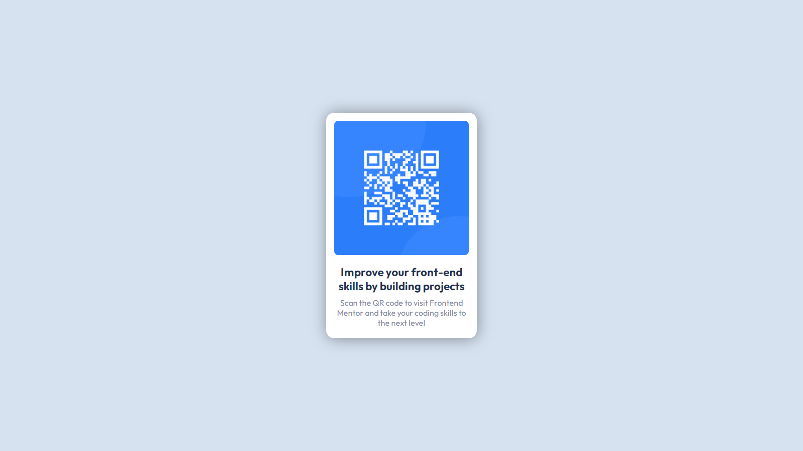

# QR-code-component---Frontend-Mentor

This is a solution to the [QR code component challenge on Frontend Mentor](https://www.frontendmentor.io/challenges/qr-code-component-iux_sIO_H). Frontend Mentor challenges help you improve your coding skills by building realistic projects. 

## Table of contents

- [Overview](#overview)
  - [The challenge](#the-challenge)
  - [Links](#links)
- [My process](#my-process)
  - [Built with](#built-with)
- [Author](#author)

## Overview

### The challenge

Your users should be able to:

  •View the optimal layout depending on their device's screen size

### Links

- Solution URL: [Link](https://www.frontendmentor.io/challenges/qr-code-component-iux_sIO_H/hub/qr-code-component-LKsPXp5gT)
- Live Site URL: [Link](https://thelaucha.github.io/QR-code-component---Frontend-Mentor/)

## My process

### Built with

- Semantic HTML5 markup
- SCSS 
- Grid

## Author

- Website - [Lautaro Espinillo](https://thelaucha.github.io/portfolio_web/)
- Frontend Mentor - [@TheLaucha](https://www.frontendmentor.io/profile/TheLaucha)
